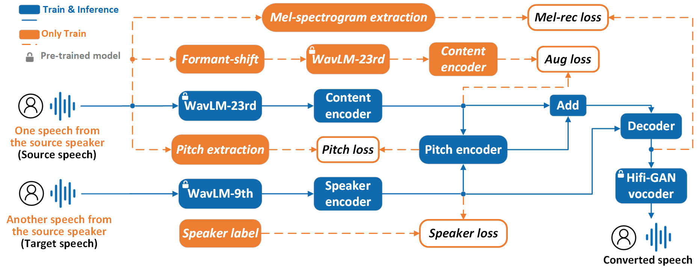

# 
 LLM-VC: Voice Conversion based on the Pre-trained Large Language Model and a Specific Disentanglement Strategy

# ABSTRACT

 One-shot voice conversion (VC) is always challenging, especially in an unseen scenario. This paper proposes a VC model based on the pre-trained large language model and a specific disentanglement strategy. On the one hand, the embeddings extracted by specific layers of pre-trained WavLM are employed as input for the speaker and content encoders, respectively, to improve the model's generalization and simplify the architectures of the two encoders. On the other hand, a specific disentanglement strategy is proposed to eliminate redundant information in embeddings obtained by WavLM. i) The formant-shifting-based augmentation loss is adopted to reduce content-irrelevant information effectively in content encoding; ii) The AM-Softmax loss is introduced to adjust the distance between different speakers; iii) L1 loss is calculated in pitch and mel-spectrogram reconstruction to improve the converted speech's quality further. Experimental results demonstrate that the proposed model achieves excellent performance in objective and subjective evaluations under both seen and unseen scenarios.

The following is the overall model architecture.

  
  
Fig.1: The overall architecture of the proposed model.

# DEMO
For the converted samples, you can visit [the demo page](https://superman-valencia.github.io/LLM-VC-Demo/).
